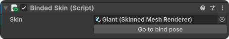
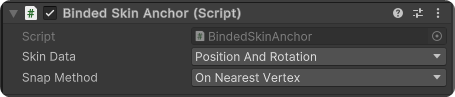

# BindedSkin
 
Relatively simple approach to bind gameObject (or juste positions & rotations) to an existing skin on Unity (CPU only, no mesh baking).
The cubes on the leg in the gif are gameObjects with a classic meshRenderer.

## Setup
Is relatively simple :
- Add the BindedSkin component to your animated object or parent.

- Add the BindedSkinAnchor component to a child object. This child should be placed next to your animated object when it's in bind pose (use the button in BindedSkin to put it in bind pose).

## Optimisation
I've added a little burst/job to the skinning function. That's as far as I went. The idea is mainly to make a proof of concept. So I didn't test to find more optimized values (like for the batch size), and there's probably a way of extending these optimizations further.
